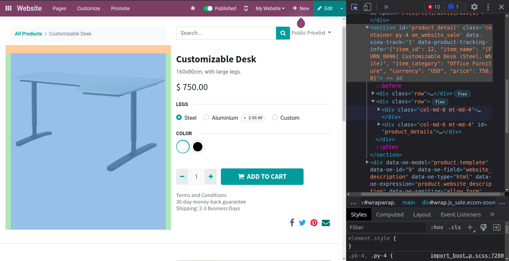

# Sally's Flower Shop - Part 3

[View the commit for this solution](https://github.com/odoo-ps/psae-btco/commit/b896c5795efe964c7a068feb0f2fbdd6240fb5bd)

### Template Inheritance

Deciding a good location to show flower details may be easy, but what is tricky is to find the template that we have
to override. We can inspect the rendered HTML and use class names from some of the elements to do a global search on the
source code. In our case, we select the location to be under the product picture which appears to be a `section` element
with the ID `product_detail`.



We find that the template we have to override is named `product` in the module `website_sale`. The next step is to
create a reliable XPath expression to target the correct location in the page. Moreover, upon source code inspection we
realize that this template has a variable called `product` which contains a reference to the product template.
Therefore, we will first fetch the associated product variant (i.e. `product.product` record) followed by the associated
flower record. Note that the user may view both flower and non-flower products on the website, which means we will show
flower details conditionally using the t-directive `t-if`.

```xml
<?xml version="1.0" encoding="UTF-8" ?>
<odoo>
    <template id="..." inherit_id="website_sale.product">
        <xpath expr="//section[@id='product_detail']" position="inside">
            <div t-if="product.product_variant_id.is_flower and product.product_variant_id.flower_id">
                <t t-set="flower" t-value="product.product_variant_id.flower_id"/>
            </div>
            ...
        </xpath>
    </template>
</odoo>
```

<GitHubButton link="https://github.com/odoo-ps/psae-btco/blob/sally-flower-shop/flower_shop/views/templates.xml"></GitHubButton>

The final result should be something like this.


This marks the completion of part 3 of the case study.