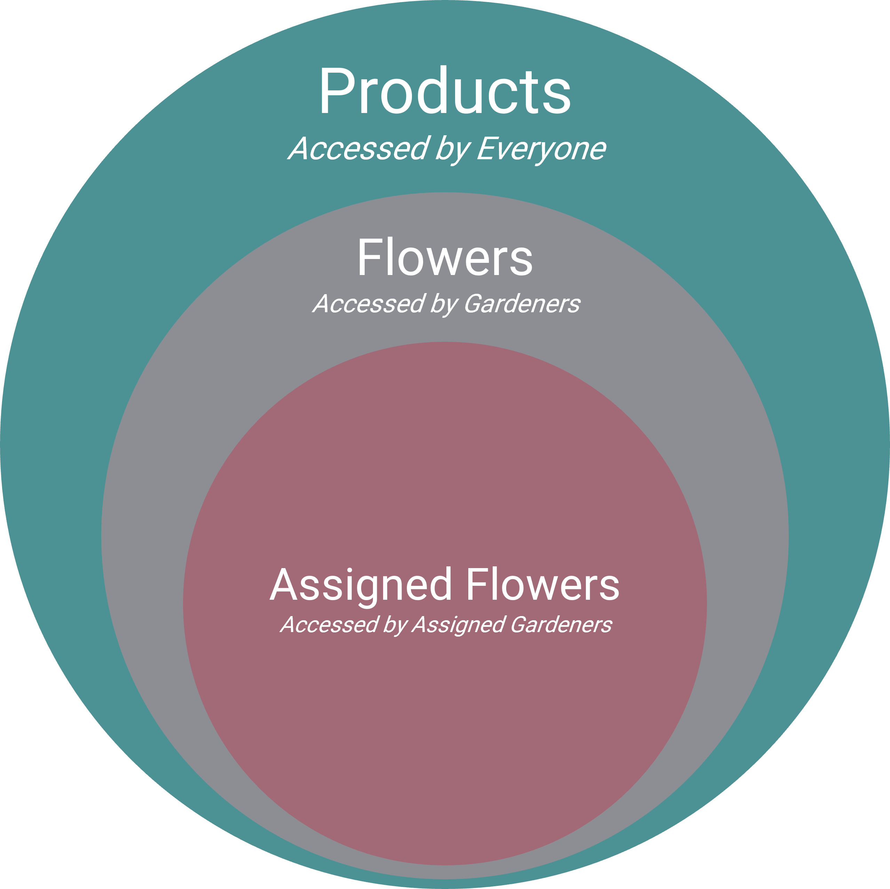

# Sally's Flower Shop - Part 6

[View the commit for this solution](https://github.com/odoo-ps/psae-btco/commit/7aa392f04e7927708b26026e898894a6afb19a62)

This exercise emphasizes on [security](www.odoo.com/documentation/16.0/developer/reference/backend/security.html) in
terms of groups and record rules, and a special model in Odoo called `ir.sequence`.

### Groups

We will create a
gardeners' [group](https://www.odoo.com/documentation/16.0/developer/reference/backend/security.html#res.groups) in a
dedicated file named `groups.xml` inside the `data` folder. It is possible to create subgroups by
specifying the `implied_ids` field. We can think of this field as _parent groups_ so that our group will inherit all
of their access rights. However, we will not need to create a subgroup for now. Moreover, the new group record is
wrapped by a `data` tag that has the attribute `noupdate="1"`. Such records will never be updated when we upgrade the
module; they will only be created when installing the module. This is a good practice when we do not want to
reset certain records during a module upgrade and rather keep the changes done on them by the user. Examples may include
groups, record rules, any demo data, and more.

```xml
<?xml version="1.0" encoding="UTF-8" ?>
<odoo>
    <data noupdate="1">
        <record id="..." model="res.groups">
            ...
        </record>
    </data>
</odoo>
```

<GitHubButton link="https://github.com/odoo-ps/psae-btco/blob/sally-flower-shop/flower_shop/data/groups.xml#L3"></GitHubButton>

### Scheduled Action

The relationship between products and serials is that a `product.product` record has many `stock.production.lot` (this
is the model for serial) records. We need to check all the serials for each flower product and if at
least one serial requires watering, then the product will be marked with a ribbon. Now, one may think of implementing
this by a computed boolean field in the `product.product` model and the compute method can depend on the serial records.
Regardless of whether you considered this approach, it cannot be done unfortunately because of the following:

- there is no reference to `stock.production.lot` (serial) records from the product, rather there is product reference
  in the serial model
- even if there was a serial reference, the aforementioned compute method needs to be triggered based on the serial
  records as well as the
  **current date** since we need to check if any serial needs watering every single day

As a rule of thumb, whenever something needs to be checked every certain time interval, this calls for a [schedule
action](https://www.odoo.com/documentation/16.0/developer/reference/backend/actions.html#automated-actions-ir-cron). We
will create a scheduled action that will run some Python code every day. To write our code, we select the `state` field
to be `code` and in the `code` field, we make a call to a model's function.

```xml
<?xml version="1.0" encoding="UTF-8" ?>
<odoo>
    <record id="..." model="ir.cron">
        ...
        <field name="state">code</field>
        <field name="code">model.action_needs_watering()</field>
    </record>
</odoo>
```

<GitHubButton link="https://github.com/odoo-ps/psae-btco/blob/sally-flower-shop/flower_shop/data/actions.xml#L49"></GitHubButton>

Notice that `model` is a variable available within the scope of the `code` field. Below is the full list of variables
available for use, copied from the form view of `ir.actions.server`:

```python
# Available variables:
#  - env: Odoo Environment on which the action is triggered
#  - model: Odoo Model of the record on which the action is triggered; is a void recordset
#  - record: record on which the action is triggered; may be void
#  - records: recordset of all records on which the action is triggered in multi-mode; may be void
#  - time, datetime, dateutil, timezone: useful Python libraries
#  - float_compare: Odoo function to compare floats based on specific precisions
#  - log: log(message, level='info'): logging function to record debug information in ir.logging table
#  - UserError: Warning Exception to use with raise
#  - Command: x2Many commands namespace
# To return an action, assign: action = {...}
```

In the function, we fetch all the flower products in the database then retrieve all the serial records that belong to
the flower products. Next, for each serial we calculate the number of days it has been since the last time it was
watered. This is then compared to `watering_frequency` of the flower to determine if it needs watering. We also use
a `defaultdict` dictionary where the keys are flower product IDs and the values can be either `True` if the product
needs watering, or `False` otherwise. Once we iterate over all the serials, we update the product records.

```python
 def action_needs_watering(self):
    flowers = self.env["product.product"].search([("is_flower", "=", True)])
    serials = self.env["stock.production.lot"].search([("product_id", "in", flowers.ids)])
    lot_vals = defaultdict(bool)
    for serial in serials:
        if serial.water_ids:
            last_watered_date = serial.water_ids[0].date
            frequency = serial.product_id.flower_id.watering_frequency
            today = fields.Date.today()
            needs_watering = (today - last_watered_date).days >= frequency
            lot_vals[serial.product_id.id] |= needs_watering
        else:
            lot_vals[serial.product_id.id] = True
    for flower in flowers:
        flower.needs_watering = lot_vals[flower.id]
```

<GitHubButton link="https://github.com/odoo-ps/psae-btco/blob/sally-flower-shop/flower_shop/models/product.py#L16"></GitHubButton>

### Sequence

If all the flower serials followed the same sequence numbering, we would have simply created an `ir.sequence` record in
XML and called it a day. However, the exercise requires that each flower should have its own sequence record. Hence, we
will add a `many2one` field in the `product.product` model so that each product record can be associated to
an `ir.sequence` record.

```python
sequence_id = fields.Many2one("ir.sequence", "Flower Sequence")
```

<GitHubButton link="https://github.com/odoo-ps/psae-btco/blob/sally-flower-shop/flower_shop/models/product.py#L12"></GitHubButton>

Next, in the `create` method of `stock.production.lot`, we will call `next_by_id()` on the product's sequence record.
This will return the next appropriate sequence number for the serial that is being created. We then assign the sequence
inside `vals` to the `name` field of the serial.

```python
@api.model_create_multi
def create(self, vals_list):
    for vals in vals_list:
        product = self.env["product.product"].browse(vals["product_id"])
        if product.sequence_id:
            vals["name"] = product.sequence_id.next_by_id()
    return super().create(vals_list)
```

<GitHubButton link="https://github.com/odoo-ps/psae-btco/blob/sally-flower-shop/flower_shop/models/stock_production_lot.py#L41"></GitHubButton>

### Multi-Record Creation

In the previous code snippet, we observe that the create method has the function decorator `model_create_multi`. This is
a common decorator used in Odoo to indicate that the method is able to create multiple records at the same time. The
main difference between having this decorator and the decorator `model` is that the former accepts a _list of
dictionaries_ whereas the latter accepts a single _dictionary_. This also explains why we had to
use a loop in our create method to iterate over `vals_list`. Furthermore, the original `stock.production.lot` model
allows multi-record creation and since we are overriding its create method for our use, we must remain consistent with
the decorator type.

If we inspect the values parameter (can be `vals` or `vals_list`, name does not matter), that is being passed to the create method, these are how their contents would look
like:

```python
# multi-record using @api.model_create_multi
vals = [{
    "name": "ABC123",
    "product_id": 2,
    "quantity": 1,
}, {
    "name": "XYZ321",
    "product_id": 3,
    "quantity": 1,
}]

# single record using @api.model
vals = {
    "name": "JKL456",
    "product_id": 5,
    "quantity": 1,
}
```

### Record Rules

[Record rules](https://www.odoo.com/documentation/16.0/developer/howtos/rdtraining/B_acl_irrules.html#record-rules) are
one of the trickiest topics in Odoo. There are two types of record rules: global rules and group-specific rules. The
following is copied from the form view of `ir.rule` and will be important in solving the exercise:

_Global rules (non group-specific) are restrictions, and cannot be bypassed.
Group-specific rules grant additional permissions, but are constrained within the bounds of global ones._

Moreover, these are how the interactions go about between global and group-specific rules:

1. Global rules are ANDed with each other
2. Group-specific rules are ORed with each other
3. Global rules and the result of group-specific rules are ANDed with each other

Example: GLOBAL_RULE_1 AND GLOBAL_RULE_2 AND ( (GROUP_A_RULE_1 OR GROUP_A_RULE_2) OR (GROUP_B_RULE_1 OR
GROUP_B_RULE_2) )

For this exercise, first we will create a global rule that basically translates to this:

_Give access to all products if the user belongs to the gardeners' group, otherwise give access to non-flower products
only._

```xml
<?xml version="1.0" encoding="UTF-8" ?>
<odoo>
    <data noupdate="1">
        <record id="..." model="ir.rule">
            ...
            <field name="domain_force">[(1,'=',1)] if user.user_has_groups('flower_shop.group_gardener') else
                [('is_flower','=',False)]
            </field>
        </record>
    </data>
</odoo>
```

<GitHubButton link="https://github.com/odoo-ps/psae-btco/blob/sally-flower-shop/flower_shop/data/rules.xml#L4"></GitHubButton>

With this record rule, any gardener can access any flower product. We now want to restrict one's access further by
creating another record rule that says:

_For a gardener user, show them flowers that either have no gardeners assigned or have the current user assigned._

```xml
<?xml version="1.0" encoding="UTF-8" ?>
<odoo>
    <data noupdate="1">
        <record id="..." model="ir.rule">
            ...
            <field name="groups" eval="[(4, ref('flower_shop.group_gardener'))]"/>
            <field name="domain_force">['|',('user_ids','=',False),('user_ids','in',user.id)]</field>
        </record>
    </data>
</odoo>
```

<GitHubButton link="https://github.com/odoo-ps/psae-btco/blob/sally-flower-shop/flower_shop/data/rules.xml#L10"></GitHubButton>

Note that this record rule applies only on the gardeners' group. While the global rule earlier allowed access to all
flower products, this group-specific rule narrows down the access instead. As a result, a user belonging to the
gardener's group will see flower products that they are assigned to and the products that do not have anybody assigned.

The result of the record rules can be depicted by the following Venn diagram:
<br/><br/>


This marks the completion of part 6 of the case study.