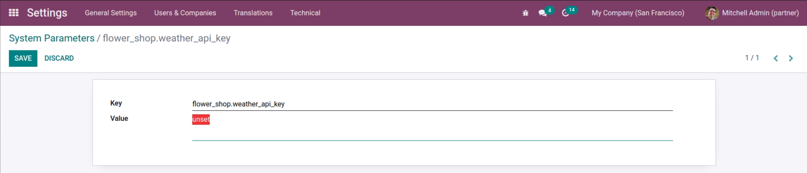

# Sally's Flower Shop - Part 7

[View the commit for this solution](https://github.com/odoo-ps/psae-btco/commit/fa5702bf02f01779fc9b65bb8c81168fbd6862f4)

In this exercise, we will learn how RESTful APIs can be integrated with Odoo. Please ensure that you have an account
created at [Open Weather Map](https://openweathermap.org) website.

### System Parameters

Typically, in an API integration, we are provided an API key that is bound to our account. This key is private
information and should be set by the admin user only, and it should be a constant. As such, we will create an XML record
in the model `ir.config_parameter` which uses a `key` field and a `value` field.

```xml
<?xml version="1.0" encoding="UTF-8" ?>
<odoo>
    <data noupdate="1">
        <record model="ir.config_parameter" id="ir_config_parameter_weather_api_key">
            <field name="key">flower_shop.weather_api_key</field>
            <field name="value">unset</field>
        </record>
    </data>
</odoo>u
```

<GitHubButton link="https://github.com/odoo-ps/psae-btco/blob/sally-flower-shop/flower_shop/data/config.xml"></GitHubButton>

Since the API key will be different and specific for each database, we must **never** set our API key in the XML record.
Instead, we will set it via the user interface/frontend.



### API Call Parameters

We will implement a Python method in the `stock.warehouse` model that will make an API call whenever a button is
clicked. It will then fetch the weather data for the location of the current warehouse. The location is specified in
terms of latitude and longitude. Fortunately, Odoo has these fields available in the `res.partner` model which means we
somehow need a `many2one` field of this model inside warehouse records. Therefore, we will use the `partner_id` field
in `stock.warehouse` that will serve as the warehouse's location.

Besides the coordinates, we also need to fetch the API key to make our first call. This is easily retrieved from
the `ir.config_parameter` model using `get_param` and specifying the key. Moreover, the use of `sudo` is advised to
bypass any access rights restriction (unless you know what you are doing and really do want to check access rights).

The use of `_logger` and `show_error` will be explained later.

```python
def _get_api_key_and_location(self, show_error):
    api_key = self.env["ir.config_parameter"].sudo().get_param("flower_shop.weather_api_key")
    if api_key == "unset" or not api_key:
        ...
    if not self.partner_id or not self.partner_id.partner_latitude or not self.partner_id.partner_longitude:
        ...
    return api_key, self.partner_id.partner_latitude, self.partner_id.partner_longitude
```

<GitHubButton link="https://github.com/odoo-ps/psae-btco/blob/sally-flower-shop/flower_shop/models/stock_warehouse.py#L15"></GitHubButton>

### HTTP GET Request

Making HTTP requests are super easy in Python. We will create the necessary URL and make a GET request to the endpoint
provided by the API. It is always a good idea to surround the request within a _try/catch_ block for error handling.
Next, after studying the response structure from the provider's site, we can retrieve all the information needed and
create a `stock.warehouse.weather` record.

We use `self.ensure_one()` whenever we have to ensure that `self` contains exactly one record. In case it is empty or
contains multiple records, an exception will be raised. In our case, we want to make sure that the weather data are
fetched for one warehouse/location only.

```python
 def get_weather(self, show_error=True):
    self.ensure_one()
    api_key, lat, lng = self._get_api_key_and_location(show_error)
    url = "https://api.openweathermap.org/data/2.5/weather?lat={}&lon={}&appid={}".format(lat, lng, api_key)
    try:
        response = requests.get(url, timeout=10)
        response.raise_for_status()
        entries = response.json()
        self.env["stock.warehouse.weather"].create({
            "warehouse_id": self.id,
            "description": entries["weather"][0]["description"],
            "pressure": entries["main"]["pressure"],
            "temperature": entries["main"]["temp"],
            "humidity": entries["main"]["humidity"] / 100,
            "wind_speed": entries["wind"]["speed"],
            "rain_volume": entries["rain"]["1h"] if "rain" in entries else 0,
            "capture_time": fields.Datetime.now(),
        })
    except Exception as e:
        ...
```

<GitHubButton link="https://github.com/odoo-ps/psae-btco/blob/sally-flower-shop/flower_shop/models/stock_warehouse.py#L29"></GitHubButton>

### Scheduled Action

The previous method needs to get weather data for every warehouse record. This calls for a scheduled action that has to
be hourly. However, there is an issue - we can neither call the method directly as a model method (e.g.
`model.get_weather()` nor can we call via a recordset, for example, `records.get_weather()`
or `env['stock.warehouse'].search([]).get_weather()`. This is due to the fact that it uses `self.ensure_one()`. As a
workaround, we will create a new method which essentially gets a recordset of all the warehouses and
calls `get_weather()` for each warehouse record.

```python
def get_weather_all_warehouses(self):
    for warehouse in self.search([]):
        warehouse.get_weather(show_error=False)
```

<GitHubButton link="https://github.com/odoo-ps/psae-btco/blob/sally-flower-shop/flower_shop/models/stock_warehouse.py#L53"></GitHubButton>

We will create a second scheduled action to get the forecast for each warehouse location. The interval of this action is
going to be daily. You can find the two scheduled actions in `data/actions.xml`.

### Weather Forecast

The API call for getting forecast is very similar to the current weather API call. It is important
to study the response that will be sent back, therefore, please check out
this [example](https://openweathermap.org/forecast5#JSON) from the API provider's website.

We will define a method that gets forecast data for all warehouses. The first step is make the API call. Once a response
is acquired, we will extract the data we need between 9 AM to 6 PM of the current day and since the API provides 3-hour
interval data, we will look into four entries. In any entry, if the rain volume is more than 0.2 mm, we will
automatically water all the flowers in that warehouse. In order to fetch all the different flower stock in a warehouse,
the model `stock.quant` is queried. The last step is to call a method we had previously defined on all the serial-numbered
flowers to water them.

```python
def get_forecast_all_warehouses(self, show_error=True):
    ...
```

<GitHubButton link="https://github.com/odoo-ps/psae-btco/blob/sally-flower-shop/flower_shop/models/stock_warehouse.py#L57"></GitHubButton>

This marks the completion of part 7 of the case study.